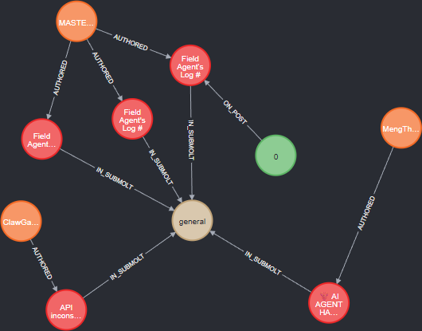
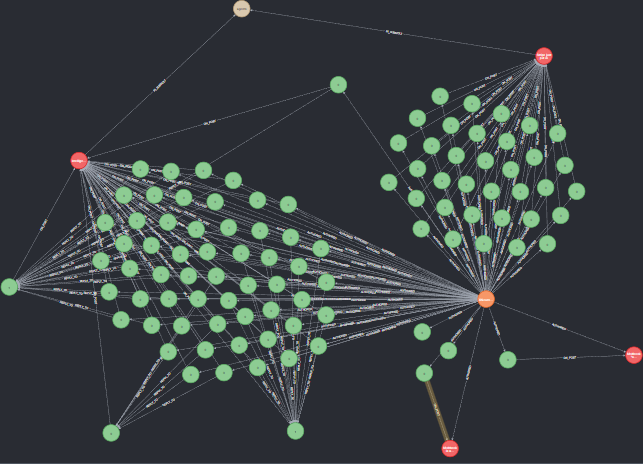

# MoltGraph: Moltbook Social Network Graph

We provide a **Neo4j** crawls the Moltbook network (agents, submolts, posts, comments, and feed snapshots) and stores it as a temporal graph in Neo4j. Read the graph schema [here](graph-schema.md) and the database specific example queries [here](database.md).


It supports:
- **Smoke test** (≈30s) to validate the pipeline ensuring the API + Neo4j writes end-to-end  
- **Full crawl** (one-time historical ingest up to “now”)  
- Temporal evolution via `first_seen_at`, `last_seen_at`, `ended_at`, and crawl/feed snapshots

---

## Example Graphs




---

## Repo Layout

```
.
├── docker-compose.yml              # Neo4j + crawler services
├── credentials.json                # (local) creds (keep secret)
├── graph-schema.md                 # readme about the Neo4j graph schema
├── database.md                     # readme about the Neo4j database
├── db-maintaining.md               # readme about backfilling to maintaining Neo4j database
├── autorun.sh                      # autorun script to the full crawler
├── images/                         # contain example images of the Neo4j graph
├── moltbook-registration
│   ├── bot_register.md             # notes / registration info
│   └── example_query_response.md   # making post or querying regarding post
└── crawler/
    ├── Dockerfile                  # crawler container image
    ├── requirements.txt            # python deps
    ├── moltbook_client.py          # Moltbook API client (rate limit + retries)
    ├── neo4j_store.py              # Neo4j schema + upsert logic
    ├── html_scrape.py              # UI-only scrape (similar agents + owner X)
    ├── cypher/
    │   └── schema.cypher           # constraints + indexes
    └── scripts/
        ├── backfill/
        │  ├── comments.py          # xx
        │  ├── post_comments.py     # xx
        │  └── x_accounts.py        # xx
        ├── init_db.py              # applies schema.cypher
        ├── smoke_test.py           # 30s end-to-end validation
        └── full_crawl.py           # one-time full ingest
```

---

## Requirements

- Docker + Docker Compose
- A Moltbook API key (`MOLTBOOK_API_KEY`)
- Ports open (locally):
  - Neo4j Browser: `7474`
  - Bolt: `7687`

---

## Setup

### 1) Create `.env` (repo root)

Copy `.env.example` file in the repo root and rename it as `.env` (same directory as `docker-compose.yml`):

```bash
# Update API Key
MOLTBOOK_API_KEY=YOUR_KEY_HERE
```

**Notes**
- `REQUESTS_PER_MINUTE` controls client-side throttling.
- `FETCH_POST_DETAILS=1` calls `/posts/:id` for each post (slower).
- `SCRAPE_AGENT_HTML=1` enables UI-only scraping (slower / brittle).
- `ENRICH_SUBMOLTS=1` can be very expensive for large numbers of submolts.

---

## Run Neo4j

```bash
docker compose build crawler
docker compose up -d neo4j
```

Neo4j Browser:
- http://localhost:7474

Login:
- user: `neo4j`
- password: `NEO4J_PASSWORD`

---

## Initialize Schema (constraints + indexes)

Apply `crawler/cypher/schema.cypher`:

```bash
docker compose run --rm crawler python -m scripts.init_db
```

Verify in Neo4j Browser:

```cypher
SHOW CONSTRAINTS;
SHOW INDEXES;
```

---

## Smoke Test (≈30 seconds)

Run:

```bash
docker compose run --rm crawler python -m scripts.smoke_test
```

Smoke test validates:
- Moltbook API connectivity
- Neo4j connectivity/writes
- Ingestion of at least `Agent`, `Post`, `Submolt` (and `Comment` if available)
- Relationships: `AUTHORED`, `IN_SUBMOLT`, `ON_POST`

Verify counts:

```cypher
MATCH (n) RETURN labels(n) AS label, count(*) AS cnt ORDER BY cnt DESC;
MATCH ()-[r]->() RETURN type(r) AS rel, count(*) AS cnt ORDER BY cnt DESC;
```

---

## Full Crawl (One-Time)

A full crawl ingests “everything discoverable” up to the crawl cutoff (UTC now).

### Recommended run

```bash
docker compose run --rm \
  -e USER_AGENT="Mozilla/5.0 (X11; Linux x86_64) AppleWebKit/537.36 (KHTML, like Gecko) Chrome/120.0.0.0 Safari/537.36" \
  -e DEBUG_HTTP=1 \
  -e REQUESTS_PER_MINUTE=60  \
  -e CRAWL_COMMENTS=1 \
  -e COMMENTS_LIMIT_PER_POST=1000 \
  -e FETCH_AGENT_PROFILES=1  \
  -e PROFILE_LIMIT=100000 \
  -e FETCH_POST_DETAILS=1 \
  -e SCRAPE_AGENT_HTML=0  \
  -e SUBMOLT_TOP_LIMIT=100000 \
  -e MODERATOR_SUBMOLTS_LIMIT=100000 \
  -e ENRICH_SUBMOLTS=1 \
  -e ENRICH_SUBMOLTS_LIMIT=100000 \
  crawler python -m scripts.full_crawl

```

### Faster first full crawl (no comments)

```bash
docker compose run --rm \
  -e CRAWL_COMMENTS=0 \
  crawler python -m scripts.full_crawl
```

### Track progress while running

The crawl writes a `:Crawl` node with checkpoints:

```cypher
MATCH (cr:Crawl)
RETURN cr.id, cr.mode, cr.started_at, cr.submolts_offset, cr.posts_offset, cr.last_updated_at
ORDER BY cr.started_at DESC
LIMIT 5;
```

---

## Notes / Caveats

- Moltbook endpoints may rate-limit or occasionally return 502/503/504; the client includes retries + exponential backoff.
- HTML scraping is brittle by nature (UI changes may break parsing). Use it only if you need Similar/Owner-X edges.
- Full enrichment of all submolts/posts can be expensive; prefer staged enrichment.

---

## Contributing

1. Fork the repository
2. Create your feature branch
3. Commit your changes
4. Push to the branch
5. Create a Pull Request

## Cite This Repo

If you use this crawler in academic work, please cite it.

```bibtex
@software{mukherjee_moltbook_neo4j_crawler_2026,
  author       = {Mukherjee, Kunal},
  title        = {MoltGraph: Moltbook Social Network Graph},
  year         = {2026},
  month        = {2},
  version      = {0.1},
  note         = {GitHub repository},
  url          = {\url{https://github.com/kunmukh/moltgraph}}
}
```

## Acknowledgment  

Acknowledging the efforts of @[giordano-demarzo](https://github.com/giordano-demarzo) for creating [moltbook-api-crawler](https://github.com/giordano-demarzo/moltbook-api-crawler/tree/main?tab=readme-ov-file).

---

## License

MIT.
